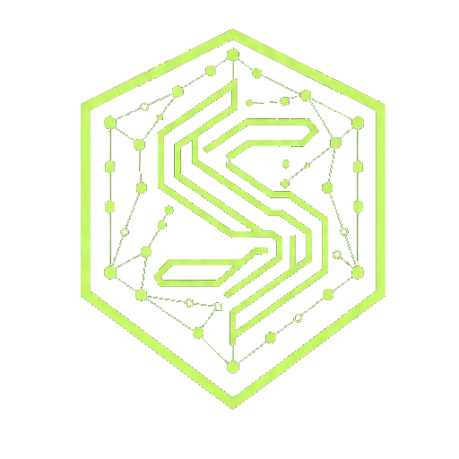
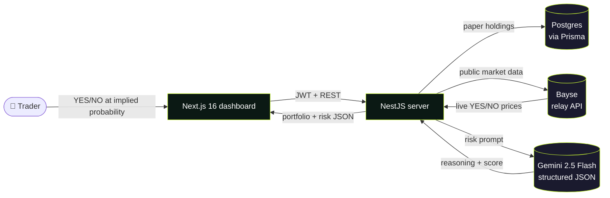
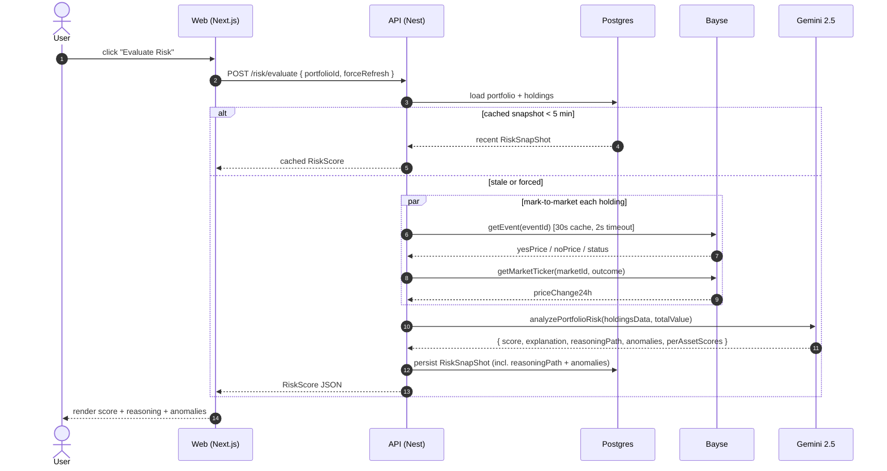

<div align="center">
  

  <h1>Synth Sentry</h1>

  <p><strong>AI-native risk analysis for prediction-market portfolios.</strong></p>

  <p>
    Built on <a href="https://bayse.markets"></a>
    &nbsp;·&nbsp; Powered by <a href="https://ai.google.dev/"></a>
  </p>

  <p>
    <a href="https://synthsentry.up.railway.app">Live demo</a>
    ·
    <a href="#-demo-video">Demo video</a>
    ·
    <a href="#-how-it-works">Architecture</a>
    ·
    <a href="DEPLOYMENT.md">Deployment</a>
  </p>
</div>

---

## 🎬 Demo Video

> 📺 **[Watch the 2-minute walkthrough](https://www.youtube.com/watch?v=YOUR_VIDEO_ID)**
>
> _Replace this link with your final video URL — Loom, YouTube, or a hosted MP4 in `/public/demo.mp4` all work. GitHub auto-embeds YouTube and Loom thumbnails._

<!-- Once the video is uploaded, swap the line above for the embed:

[](https://www.youtube.com/watch?v=YOUR_VIDEO_ID)

-->

---

## ✨ The 30-second pitch

Prediction markets crossed **$12B in volume** last year. The portfolio tooling traders use to manage risk is still built for stocks — concentration, correlation, and tail-event exposure across a YES/NO book are invisible to retail traders.

**Synth Sentry** is portfolio-risk infrastructure for prediction markets. Build a paper book against live Bayse markets, mark-to-market in real time, and run a Gemini risk analysis that doesn't just score you — it shows the **reasoning path**, step by step.

| What it does | What it gives you |
| --- | --- |
| Search live Bayse markets and add YES/NO holdings | A real-time portfolio with entry / current / P&L per position |
| Click **Evaluate Risk** | Gemini score + plain-language explanation + 5-step reasoning + flagged anomalies |
| Snapshot every evaluation | Point-in-time risk history per portfolio |
| Set per-holding alert thresholds | Triggers when AI score crosses your line |

---

## 🧠 How It Works



### The "Evaluate Risk" flow

The core sequence — what happens when a user clicks the **Evaluate Risk** button:



**Key design decisions:**

- **Paper trading, not brokerage mirror.** Holdings live in our DB. We snapshot the implied probability + outcome at buy-time so P&L is honest even when Bayse positions don't exist. (See [design spec](docs/superpowers/specs/2026-04-29-paper-trading-portfolio-design.md).)
- **30-second event cache.** Repeated portfolio loads during a demo are <100ms instead of N×Bayse round-trips.
- **2-second per-call timeout + `Promise.allSettled`.** One slow Bayse call can't blank the whole portfolio render.
- **Reasoning path persisted on every snapshot.** Risk history shows *what the AI was thinking at the time*, not just the score.

---

## 🏗️ Tech Stack

| Layer | Stack |
| --- | --- |
| **Web** | Next.js 16.2 · React 19.2 · Tailwind v4 · TanStack Query · Hugeicons |
| **Server** | NestJS 11 · Prisma 7 · class-validator · Swagger |
| **Database** | Postgres |
| **AI** | Google Gemini 2.5 Flash (JSON-mode, temp 0.3) |
| **Markets** | Bayse Relay API (HMAC-signed read auth + public market data) |
| **Auth** | JWT (Passport) |
| **Deploy** | Railway (Dockerfile-driven) · GCP Cloud Deploy (alt path, see [DEPLOYMENT.md](DEPLOYMENT.md)) |

---

## 🚀 Quick Start

```bash
# 1. Clone and install
git clone https://github.com/Maxima24/synthSentry.git
cd synthSentry/frontend
pnpm install

# 2. Set up env vars
cp apps/web/.env.local.example apps/web/.env.local
# Fill in NEXT_PUBLIC_API_BASE_URL=http://localhost:3001 (or your server URL)

# Server env (apps/server/.env):
# DATABASE_URL=postgresql://...
# JWT_SECRET=<long random string>
# GEMINI_API_KEY=<from https://ai.google.dev/>
# BAYSE_API_KEY=<from Bayse dashboard>
# BAYSE_SECRET_KEY=<from Bayse dashboard>
# RISK_TEST_SECRET=<optional — gates /risk/test smoke endpoint>

# 3. Apply DB migrations
cd apps/server
npx prisma migrate deploy
npx prisma generate

# 4. Run dev servers (two terminals)
# Terminal 1
cd apps/server && pnpm dev

# Terminal 2
cd apps/web && pnpm dev
```

Open [http://localhost:3000](http://localhost:3000) — sign up, create a portfolio, search a market, paper-trade your first YES/NO, click Evaluate Risk.

---

## 📡 API Surface

| Endpoint | Auth | What it does |
| --- | :-: | --- |
| `POST /auth/register` · `/auth/login` | – | JWT issuance |
| `GET /portfolio` | 🔒 | List user portfolios |
| `POST /portfolio` | 🔒 | Create portfolio |
| `GET /portfolio/:id` | 🔒 | Portfolio with mark-to-market prices + P&L |
| `DELETE /portfolio/:id` | 🔒 | Delete portfolio (cascades to holdings) |
| `GET /portfolio/search?keyword=` | 🔒 | Search live Bayse markets |
| `POST /portfolio/:id/holdings` | 🔒 | Paper-buy `{ symbol, outcome: YES\|NO, quantity }` |
| `DELETE /portfolio/holdings/:id` | 🔒 | Remove holding |
| `POST /risk/evaluate` | 🔒 | **The Gemini analysis.** Returns score + reasoning + anomalies |
| `POST /risk/simulate` | 🔒 | "What if" — re-score with one holding's price replaced |
| `GET /risk/history/:portfolioId` | 🔒 | Snapshot history with reasoning |
| `GET /risk/summary/:portfolioId` | 🔒 | Dashboard summary (portfolio + risk + alerts) |
| `POST /risk/alerts/:holdingId` | 🔒 | Set per-holding score threshold |
| `POST /risk/test` | header | Unauthenticated smoke test (gated by `RISK_TEST_SECRET`) |

Full Swagger at `/api-docs` once the server is running.

---

## 📂 Repository Layout

```
frontend/
├── apps/
│   ├── server/               # NestJS API (Postgres + Prisma + Gemini + Bayse)
│   │   ├── src/modules/
│   │   │   ├── portfolio/    # Holdings + paper-trading flow
│   │   │   ├── risk/         # Gemini risk evaluation + snapshots + alerts
│   │   │   ├── gemini/       # Gemini service + smoke endpoint
│   │   │   ├── bayse/        # Bayse Relay client + 30s event cache
│   │   │   └── auth/         # JWT auth
│   │   └── prisma/           # Schema + migrations
│   └── web/                  # Next.js 16 dashboard (App Router)
│       └── app/(dashboard)/  # Portfolios, dashboard, alerts pages
├── docs/superpowers/
│   ├── specs/                # Design specs
│   └── plans/                # Implementation plans
└── DEPLOYMENT.md             # GCP / Railway deploy notes
```

---

## 🗺️ Roadmap

- [x] Paper-trading portfolio (YES/NO holdings, weighted-avg entry)
- [x] Live mark-to-market against Bayse market data
- [x] Gemini risk evaluation with reasoning path + anomalies
- [x] Per-portfolio risk snapshot history
- [x] Per-holding alert thresholds
- [ ] What-if simulator surfaced in UI (backend already shipped)
- [ ] Portfolio sharing / public read-only links
- [ ] Real-money mode (move from paper to actual Bayse account integration)
- [ ] Multi-portfolio cross-correlation analysis
- [ ] WebSocket live price push (currently 30s cache + on-render refresh)

---

## 🎨 Design Philosophy

The **Dual-Theme architecture** — dark, neon-accented landing page (the marketing surface) and a light, airy dashboard (the financial surface). All design tokens live in [apps/web/app/globals.css](apps/web/app/globals.css). See [CLAUDE.md](CLAUDE.md) for the full "VC standard" rule set: rounded radii hierarchy, matte frame pattern, border-color rules, the dark/light split, and the icon library policy (Hugeicons only).

---

## 📜 License

Proprietary. Hackathon submission — built for [Hackathon Name].

<div align="center">
  <sub>Built with care by the Synth Sentry team.</sub>
</div>
